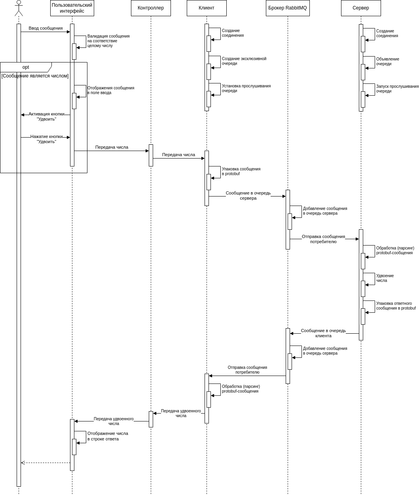

# 57-cpp-rabbitmq-qt-template

Работа с брокером сообщений (LEARNING_CENTER-57)

## Основные параметры работы с брокером
### Exchange
В коде `exchange` задается пустой строкой, что приводит к использованию обмена по умолчанию (AMQP default), который имеет тип direct. Этот тип подходит для задачи, поскольку один сервер должен рассылать сообщения нескольким клиентам. Для распределения сообщения с некоторым условием (например, указание адресата) удобно использовать direct exchange.

### Поддержка нескольких клиентов
При инициализации клиента очередь, принимающая ответ от сервера, создается методом `queue_declare(queue='', exclusive=True)`. Пустая строка вместо имени очереди означает, что оно сгенерируется автоматически, а аргумент `exclusive=True` гарантирует, что у каждого клиента будет своя собственная очередь. Все клиенты отправляют запросы в единую очередь сервера (по умолчанию `server_queue`). При отправке сообщения методом `basic_publish` указывается аргумент `properties`:

```python
self.channel.basic_publish(
                exchange='',
                routing_key=SERVER_QUEUE,
                properties=pika.BasicProperties(
                    reply_to=self.callback_queue,
                    correlation_id=self.corr_id,
                ),
                body=serialized_message)
```

`properties` содержит `reply_to` (очередь, куда сервер должен отправить ответ, она же уникальная очередь клиента) и `correlation_id` (один из способов предотвращения получения клиентов чужих вообщений).

Таким образом поддержка нескольких клиентов достигается созданием уникальной очереди для каждого клиента и проверки `correlation_id`, который задается как `str(uuid.uuid4())`, что дает уникальный идентификатор для каждого запроса.

### Порядок создания exchange и очередей

Как было упомянуто выше, в данной программе используется default exchange. Из документации RabbitMQ:

> The default exchange is a direct exchange with no name (empty string) pre-declared by the broker. It has one special property that makes it very useful for simple applications: every queue that is created is automatically bound to it with a routing key which is the same as the queue name.

Таким образом, можно не волноваться о создании exchange. Если сервер rabbitmq запущен, то exchange уже существует. Кроме того, очереди автоматически привязываются к этому обменнику с помощью ключа маршрутизации (routing key), что позволяет указывать только названия очередей и без лишних трудностей осуществлять обмен сообщениями так, будто они отправляются непосредственно в очередь.

### Независимость порядка запуска

Порядок запуска приложений не имеет значения благодаря тому, что используется default exchange. И клиенты, и сервер подключаются к уже существующему обменнику. Если первым был запущен сервер, то он начинает прослушивать свою очередь, название которой указывается в конфигурации, и ждет сообщений. Если первым запускается клиент, то он также подключается к уже существующему обменнику и может сразу отправлять в него сообщения. Эти сообщения будут храниться в обменнике (передаваться в очередь сервера). Как только сервер будет запущен, сообщения будут обработаны. Кроме того, для клиента можно задать время ожидания ответа от сервера (по умолчанию 3 секунды).

Клиент и сервер объявляют одну и ту же очередь сервера, чтобы избежать потери сообщений, когда первым был запущен клиент и он успел отправить сообщение до того, как был запущен сервер. При этом такой подход не вызывает ошибок, так как попытка создать очередь игнорируется, если уже есть очередь с таким именем.

## Диаграмма последовательности

